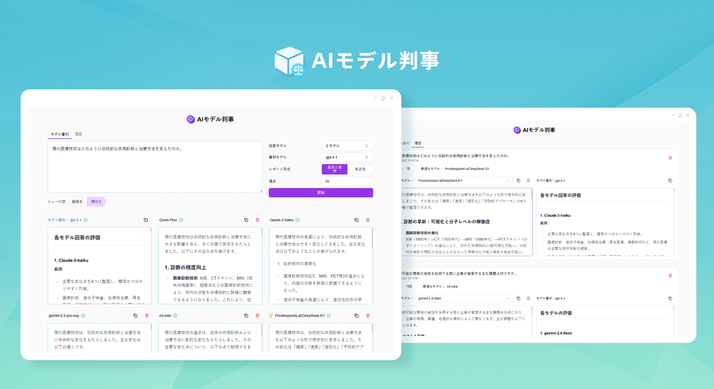
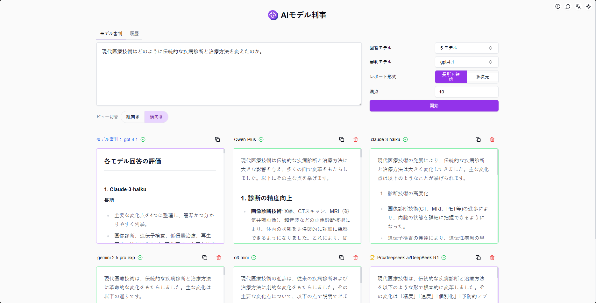
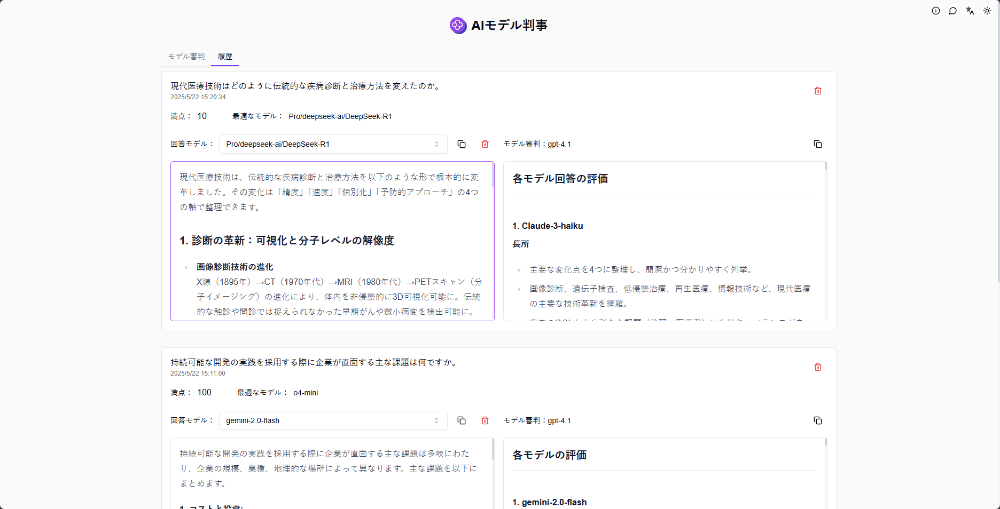

# <p align="center"> ⚖️ AIモデル判事 🚀✨</p>

<p align="center">AIモデル判事は、複数のモデルを一度にテストし、包括的な評価結果を迅速に取得して、ニーズに最も適したモデルを選択することができます。</p>

<p align="center"><a href="https://302.ai/ja/tools/judge/" target="blank"></a></p >

<p align="center"><a href="README_zh.md">中文</a> | <a href="README.md">English</a> | <a href="README_ja.md">日本語</a></p>



[302.AI](https://302.ai/ja/)の[AIモデル判事](https://302.ai/ja/tools/judge/)のオープンソース版です。
302.AIに直接ログインすることで、コード不要、設定不要のオンライン体験が可能です。
あるいは、このプロジェクトをニーズに合わせてカスタマイズし、302.AIのAPI KEYを統合して、自身でデプロイすることもできます。

## インターフェースプレビュー
任意の質問や説明を入力し、モデルリストから回答用と評価用のAIモデルをそれぞれ選択します。評価モデルは他のモデルの回答を評価し、スコアを付けます。評価結果に基づいて、ニーズに最も適したモデルを選択できます。      


完全な履歴機能を提供し、生成記録の閲覧と管理が容易に行えます。
                   

## プロジェクトの特徴
### 🤖 マルチモデル比較
複数のAIモデルを同時にテストし、性能の違いを迅速に比較できます。
### ⚖️ インテリジェント評価
AIモデルが審判となり、他のモデルの回答を客観的に評価します。
### 📊 評価レポート
詳細な評価レポートを生成し、ユーザーが賢明な選択を行えるようサポートします。
### 📝 履歴記録
完全な履歴機能により、生成記録の閲覧と管理が容易です。
### 🌍 多言語サポート
- 中国語インターフェース
- 英語インターフェース
- 日本語インターフェース

## 🚩 将来のアップデート計画
- [ ] より多くの評価指標と基準を追加

## 🛠️ 技術スタック

- **フレームワーク**: Next.js 14
- **言語**: TypeScript
- **スタイリング**: TailwindCSS
- **UIコンポーネント**: Radix UI
- **状態管理**: Jotai
- **フォーム処理**: React Hook Form
- **HTTPクライアント**: ky
- **国際化**: next-intl
- **テーマ**: next-themes
- **コード規約**: ESLint, Prettier
- **コミット規約**: Husky, Commitlint

## 開発&デプロイ
1. プロジェクトのクローン
```bash
git clone https://github.com/302ai/302_ai_ai_model_judge
cd 302_ai_ai_model_judge
```

2. 依存関係のインストール
```bash
pnpm install
```

3. 環境設定
```bash
cp .env.example .env.local
```
必要に応じて`.env.local`の環境変数を修正してください。

4. 開発サーバーの起動
```bash
pnpm dev
```

5. プロダクションビルド
```bash
pnpm build
pnpm start
```

## ✨ 302.AIについて ✨
[302.AI](https://302.ai/ja/)は企業向けのAIアプリケーションプラットフォームであり、必要に応じて支払い、すぐに使用できるオープンソースのエコシステムです。✨
1. 🧠 包括的なAI機能：主要AIブランドの最新の言語、画像、音声、ビデオモデルを統合。
2. 🚀 高度なアプリケーション開発：単なるシンプルなチャットボットではなく、本格的なAI製品を構築。
3. 💰 月額料金なし：すべての機能が従量制で、完全にアクセス可能。低い参入障壁と高い可能性を確保。
4. 🛠 強力な管理ダッシュボード：チームやSME向けに設計 - 一人で管理し、多くの人が使用可能。
5. 🔗 すべてのAI機能へのAPIアクセス：すべてのツールはオープンソースでカスタマイズ可能（進行中）。
6. 💪 強力な開発チーム：大規模で高度なスキルを持つ開発者集団。毎週2-3の新しいアプリケーションをリリースし、毎日製品更新を行っています。才能ある開発者の参加を歓迎します。
